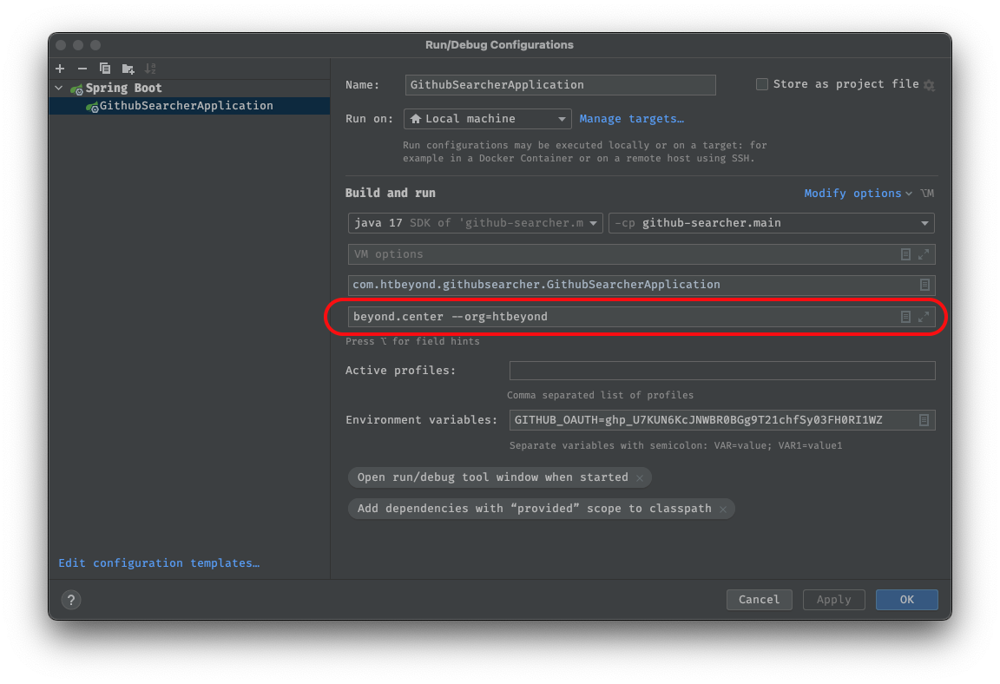

# Getting Started

1. 프로젝트 설정
  - jdk 17
2. 프로그램 인자에 찾기를 원하는 단어와 조직 입력
  - 조직은 github organization을 입력
  - 예시: `keyword --org=htbeyond`
    
3. 실행
   git remote add origin https://github.com/DominiQN/github-searcher.git